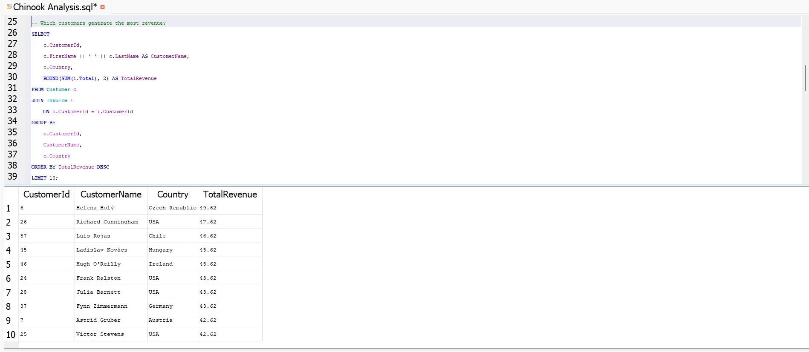

# Customer SQL Analysis (Chinook Database)

## 📌 Project Overview
This project focuses on analyzing customer behavior, revenue performance, and churn risk using SQL.  
The analysis is based on the **Chinook database**, a digital media store dataset that simulates real-world sales and customer transactions.

The goal of this project is to demonstrate practical SQL skills for business analysis, including customer segmentation, revenue analysis, and churn-risk identification.

---

## 📊 SQL Analysis – Top Customers by Revenue

The following query identifies the **top 10 customers by total revenue**, helping the business understand
which customers contribute the most value.

---

## 🎯 Business Objectives
- Understand customer distribution across countries
- Identify top revenue-generating customers
- Analyze revenue performance by genre and over time
- Detect customers at risk of churn based on purchasing behavior

---

## 🗂 Dataset Overview
**Database:** Chinook (SQLite)

**Key Tables Used:**
- `Customer` – customer demographics and location
- `Invoice` – purchase transactions
- `InvoiceLine` – individual items per transaction
- `Track` – digital products sold
- `Genre` – music categories

---

## 🧠 SQL Analyses Performed

### 1️⃣ Customer Analysis
**File:** `01_customer_analysis.sql`
- Total customer count
- Customer distribution by country
- Top countries by customer count and revenue

**Business Insight:**  
Customer concentration and revenue contribution vary significantly by region, highlighting priority markets for growth.

---

### 2️⃣ Revenue Analysis
**File:** `02_revenue_analysis.sql`
- Top 10 customers by total revenue
- Revenue contribution by genre
- Monthly revenue trend analysis

**Business Insight:**  
A small group of customers contributes a large share of revenue, and revenue trends show clear seasonality patterns.

---

### 3️⃣ Customer Risk Analysis
**File:** `03_customer_risk_analysis.sql`
- Identification of customers with low purchase frequency
- Detection of customers with long inactivity periods
- High-risk churn customer segmentation

**Business Insight:**  
Customers with infrequent purchases and long gaps between transactions are at higher risk of churn and should be targeted with retention strategies.

---

## 🛠 Tools & Skills Demonstrated
- SQL querying (SELECT, JOIN, GROUP BY, HAVING)
- Aggregate functions and subqueries
- Date-based analysis
- Business-oriented data interpretation
- SQLite database handling

---

## 📈 Key Takeaways
- SQL can effectively uncover customer behavior and revenue drivers
- Data-driven insights support targeted retention and marketing strategies
- This project demonstrates end-to-end analytical thinking, from raw data to business insight

---

## 👤 Author
Chibuike Henry  
Aspiring Data Analyst
